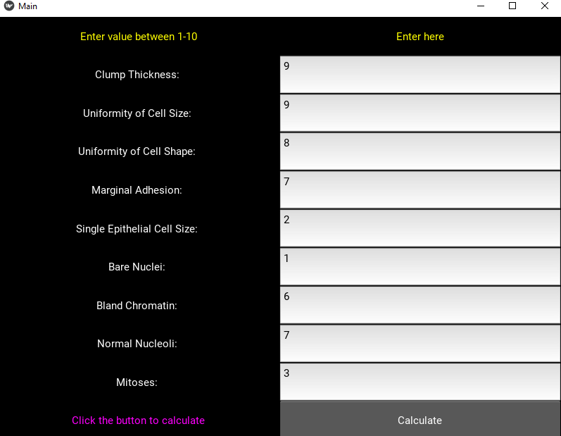

# Breast-Cancer-Prediction-using-Logistic-Regression-deployed-on-a-Kivy-App
A simple app is desiged which takes the following medical parameters inputs as to determine if tumor is benign or malignant. 

1. Clump Thickness: 1 - 10
2. Uniformity of Cell Size: 1 - 10
3. Uniformity of Cell Shape: 1 - 10
4. Marginal Adhesion: 1 - 10
5. Single Epithelial Cell Size: 1 - 10
6. Bare Nuclei: 1 - 10
7. Bland Chromatin: 1 - 10
8. Normal Nucleoli: 1 - 10
9. Mitoses: 1 - 10 

Click calculate to determine malignancy.


# Prerequisites
Libraries you need to install before running the code

1. Install Kivy using Anaconda
```
conda install kivy -c conda-forge
```
2. Install scikit-learn 
```
conda install scikit-learn
```
3. Install pandas
```
pip install pandas
```
# Running code
Open Ananconda prompt. Navigate to the environment with Kivy, scikit-learn and pandas installed using activate command.
```
activate <env_name>
```
Run spyder using the following command.
```
start spyder
```
Open correct file directory consisting of main.py, main.kv and breast_cancer.csv.
Go to the Run option on Spyder and click Configuration per file or press Ctrl+F6. Select 'Execute in an external system terminal'. Directly running on console may give the following error:
```
ArgumentError: argument 3: <class 'TypeError'>: wrong type
```
# Acknowledgements
Dataset from UCI Machine Learning Repository.
https://archive.ics.uci.edu/ml/datasets/Breast+Cancer+Wisconsin+%28Original%29

Excellent work done by Brittany Wenger.
https://sites.google.com/a/googlesciencefair.com/science-fair-2012-project-64a91af142a459cfb486ed5cb05f803b2eb41354-1333130785-87/home

# Notes
The files in this repository are only for practising coding. Not to be used for any medical diagnosis.
